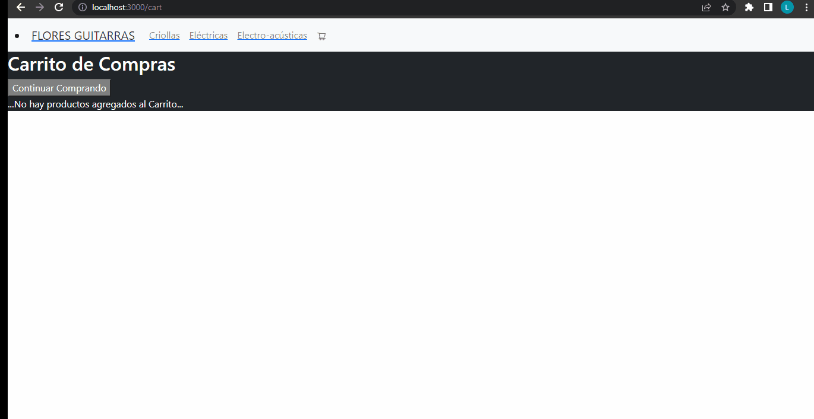

## FLORES GUITARRAS
Es un ecommerce de guitarras creado por y para músicos, desarrollado en React como proyecto final correspondiente al curso de CoderHouse.

La navegación incluye:

Home con productos

Pantalla de producto con detalle

Pantalla de categorías

Pantalla de carrito

Se puede enviar un pedido ingresando los datos del comprador desde la pantalla de carrito.

## Autor
Lautaro Flores - [@Lautaroaflores](https://github.com/Lautaroflores)

## Documentación

[React Js](https://reactjs.org/docs/getting-started.html)
## API Reference

Datos guardados en [Firebase](https://firebase.google.com/)

## Screenshots

